# 🎯 RELAY: Multi-Agent Customer Support Platform

> Modern multi-agent AI customer support system with intelligent query routing and specialized domain handlers

## 📊 Tech Stack

### Frontend


### Backend


### Database & Auth


### AI & ML


### UI Components


---

## 🏗️ System Architecture


---

## 🔄 Request Flow


---

## 🎯 Agent System Architecture

```mermaid
graph LR
    subgraph "Agent Hierarchy"
        R[Router Agent<br/>🎯 Intent Classifier]
        
        S[Support Agent<br/>💬 General Support]
        O[Order Agent<br/>📦 Order Management]
        B[Billing Agent<br/>💳 Payment Handling]
        
        R -->|FAQ/Login Issues| S
        R -->|Order #1234| O
        R -->|Invoice INV-*| B
    end
    
    subgraph "Support Tools"
        S1[Knowledge Base Search]
        S2[Account Assistance]
        S3[Troubleshooting Guide]
        S4[Password Reset]
        
        S --> S1
        S --> S2
        S --> S3
        S --> S4
    end
    
    subgraph "Order Tools"
        O1[Order Lookup]
        O2[Tracking Status]
        O3[Delivery Updates]
        O4[Order Modification]
        
        O --> O1
        O --> O2
        O --> O3
        O --> O4
    end
    
    subgraph "Billing Tools"
        B1[Invoice Retrieval]
        B2[Payment Processing]
        B3[Refund Handler]
        B4[Subscription Manager]
        
        B --> B1
        B --> B2
        B --> B3
        B --> B4
    end

    style R fill:#4285F4,stroke:#1a73e8,color:#fff
    style S fill:#34A853,stroke:#0f9d58,color:#fff
    style O fill:#FBBC04,stroke:#f9ab00,color:#000
    style B fill:#EA4335,stroke:#d33b2c,color:#fff
```



---

## 📁 Project Structure

```
customer-care/
├── clone-relay-chat/          # Next.js Frontend
│   ├── app/
│   │   ├── (protected)/       # Auth-protected routes
│   │   │   ├── chat/          # Multi-agent chat interface
│   │   │   ├── conversations/ # Conversation history
│   │   │   ├── dashboard/     # Analytics dashboard
│   │   │   └── orders/        # Order management
│   │   ├── docs/              # Documentation page
│   │   ├── login/             # Authentication
│   │   ├── signup/            # User registration
│   │   └── page.tsx           # Landing page
│   └── components/            # React components
│       ├── ui/                # Shadcn UI components
│       ├── user-nav.tsx       # User profile dropdown
│       ├── nav-sidebar.tsx    # Navigation sidebar
│       └── theme-toggle.tsx   # Theme switcher
│
└── backend/                    # Hono.js Backend
    ├── src/
    │   ├── agents/            # Multi-agent system
    │   │   ├── base.agent.ts
    │   │   ├── router.agent.ts
    │   │   ├── support.agent.ts
    │   │   ├── order.agent.ts
    │   │   └── billing.agent.ts
    │   ├── services/          # Business logic
    │   │   ├── agent.service.ts
    │   │   ├── order.service.ts
    │   │   ├── payment.service.ts
    │   │   └── conversation.service.ts
    │   ├── routes/            # API endpoints
    │   │   ├── chat.routes.ts
    │   │   ├── agent.routes.ts
    │   │   ├── user.routes.ts
    │   │   └── health.routes.ts
    │   ├── middleware/        # Request middleware
    │   └── index.ts           # Server entry point
    └── prisma/
        └── schema.prisma      # Database schema
```

---

## 🚀 Getting Started

### Prerequisites
- Node.js 20.11+
- PostgreSQL 15+
- Google Gemini API Key
- Supabase Account

### Frontend Setup

```bash
cd relay
npm install
```

Create `.env.local`:
```env
NEXT_PUBLIC_SUPABASE_URL=your_supabase_url
NEXT_PUBLIC_SUPABASE_ANON_KEY=your_supabase_anon_key
```

Run development server:
```bash
npm run dev
```

### Backend Setup

```bash
cd backend
npm install
```

Create `.env`:
```env
DATABASE_URL=your_postgresql_connection_string
SUPABASE_URL=your_supabase_url
SUPABASE_ANON_KEY=your_supabase_anon_key
SUPABASE_SERVICE_ROLE_KEY=your_service_role_key
GOOGLE_GENERATIVE_AI_API_KEY=your_gemini_api_key
JWT_SECRET=your_jwt_secret
PORT=3001
NODE_ENV=development
```

Generate Prisma client and seed database:
```bash
npm run db:generate
npm run db:push
npm run db:seed
```

Run development server:
```bash
npm run dev
```

---

## 🎨 Features

### ✨ Core Features
- **Multi-Agent AI System**: Intelligent query routing with specialized domain handlers
- **Real-time Chat**: Streaming AI responses with conversation history
- **Order Management**: Track orders, view status, and manage deliveries
- **Payment Handling**: Invoice retrieval, refunds, and payment processing
- **User Authentication**: Secure JWT-based auth with Supabase
- **Dark Mode**: Theme toggle with smooth animations
- **Responsive Design**: Mobile-first UI with Tailwind CSS
- **Analytics Dashboard**: Agent performance metrics and insights

### 🤖 Agent Capabilities

#### Router Agent
- Intent classification using Google Gemini
- Confidence scoring for routing decisions
- Dynamic agent delegation
- Context-aware query analysis

#### Support Agent
- FAQ handling
- Account assistance
- Password reset management
- General troubleshooting

#### Order Agent
- Order status lookup
- Tracking number retrieval
- Delivery date estimation
- Order modification support

#### Billing Agent
- Invoice generation and retrieval
- Payment processing
- Refund handling
- Subscription management

---

## 📊 Database Schema

### Core Tables
- **users**: User accounts and profiles
- **conversations**: Chat conversation threads
- **messages**: Individual chat messages with agent metadata
- **orders**: Order information and tracking
- **payments**: Payment transactions and invoices
- **agent_metrics**: Agent performance analytics

### Security
- Row Level Security (RLS) enabled on all tables
- JWT token verification
- User-scoped data access
- Rate limiting on API endpoints

---

## 🔧 API Endpoints

### Chat Routes
- `POST /api/chat` - Send message and get AI response
- `GET /api/chat/conversations` - List user conversations
- `GET /api/chat/conversations/:id` - Get conversation details

### Agent Routes
- `GET /api/agents/metrics` - Retrieve agent performance metrics
- `POST /api/agents/feedback` - Submit agent feedback

### User Routes
- `GET /api/user/profile` - Get user profile
- `GET /api/user/orders` - List user orders
- `GET /api/user/orders/:orderNumber` - Get order details

### Health Check
- `GET /api/health` - Server health status

---

## 🎯 Deployment

### Frontend (Vercel)
```bash
cd relay
vercel --prod
```

### Backend (Railway/Render)
1. Connect GitHub repository
2. Set environment variables from `.env.example`
3. Build command: `npm run build && npx prisma generate`
4. Start command: `node dist/index.js`
5. Auto-deploy on push

---

## 📈 Performance

- **AI Response Time**: < 2 seconds (streaming)
- **API Latency**: < 100ms (cached queries)
- **Database Queries**: Optimized with Prisma indexes
- **Rate Limiting**: 100 requests/minute per user
- **Concurrent Users**: Horizontal scaling ready

---

## 🤝 Contributing

1. Fork the repository
2. Create feature branch (`git checkout -b feature/amazing-feature`)
3. Commit changes (`git commit -m 'Add amazing feature'`)
4. Push to branch (`git push origin feature/amazing-feature`)
5. Open Pull Request

---

## 📝 License

This project is built for educational purposes as part of a technical assessment round by a startup.

---


## 🙏 Acknowledgments

- **Supabase** - Database and authentication
- **Google Gemini** - AI inference
- **Vercel** - AI SDK and deployment
- **Shadcn UI** - Component library
- **Radix UI** - Accessible primitives

---

<div align="center">

**BUILT WITH ❤️ FOR MODERN CUSTOMER SUPPORT**


</div>
